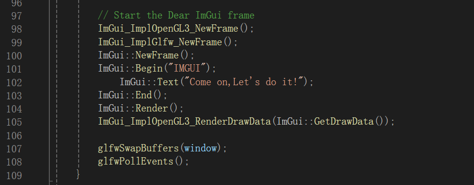
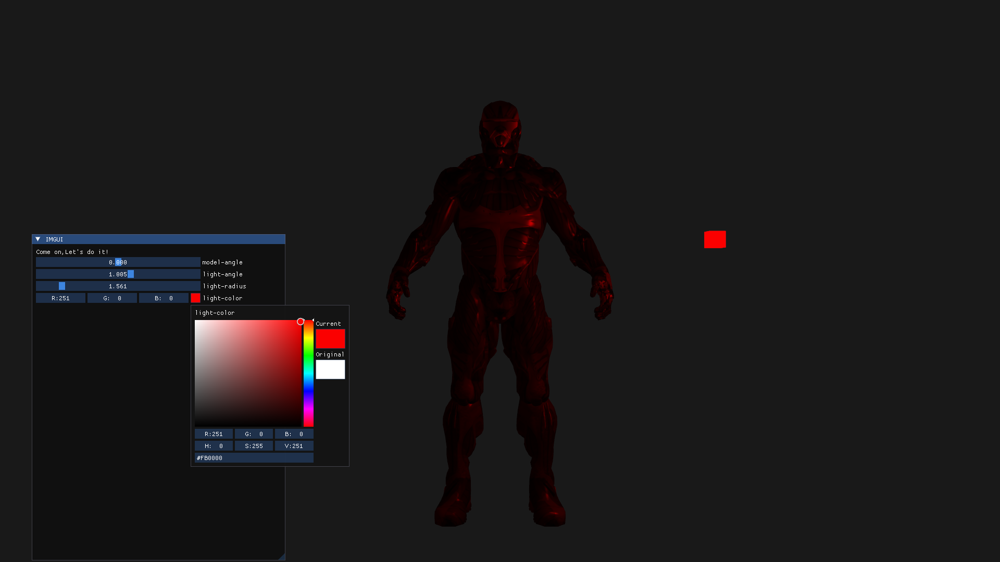
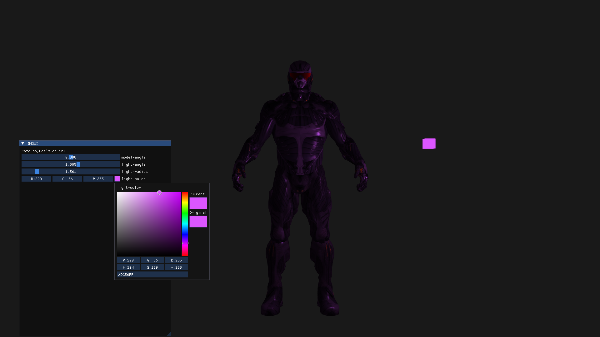
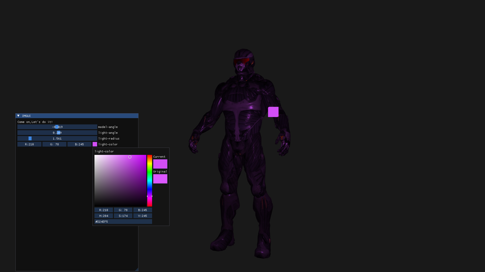
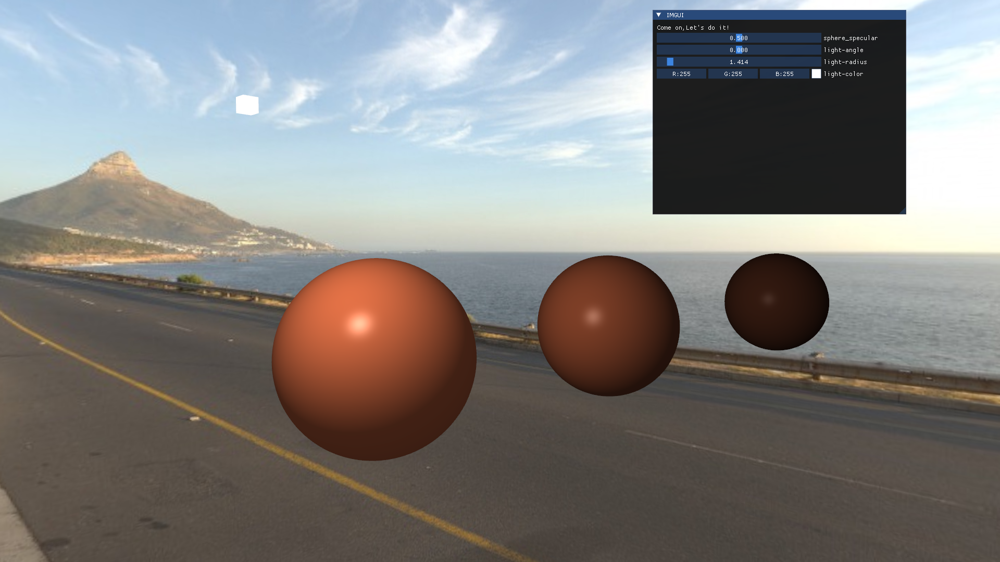

# 3DRender

## 参考项目
- [LearnOpenGL](https://learnopengl.com/)

## Quickly USE

### Visual Studio 2022
-  Clone code local:
	```
	git clone https://github.com/zsh-Iresh/3DRender.git
	```
- Open visual studio 2022  
	1. create an empty project  
	2. file -> open -> Cmake
	3. select CMakeLists.txt in the root directory 

## Assimp-3DModel

### Instruction  

- If you wanna quickly develop your own skeletal animation or 3D model rendering:  

	```
	git clone https://github.com/zsh-Iresh/3DRender.git
	```
	```
	git checkout c0d68ccdc4c6e18424c079fc5629edbdd800ea2e
	```
- In this version branch,you can find the 3D model in the assets/model folder which contains a simple nanosuit model.
If you have your own 3D model,you can create it using following code in main.cpp:  
	```
	Model assimp_model = Model("assets/model/nanosuit/nanosuit.obj");
	```
- If you wanna use imgui,you can refer to imgui.cpp and 
add components at the code location in the following image:  

	

## 部分截图



