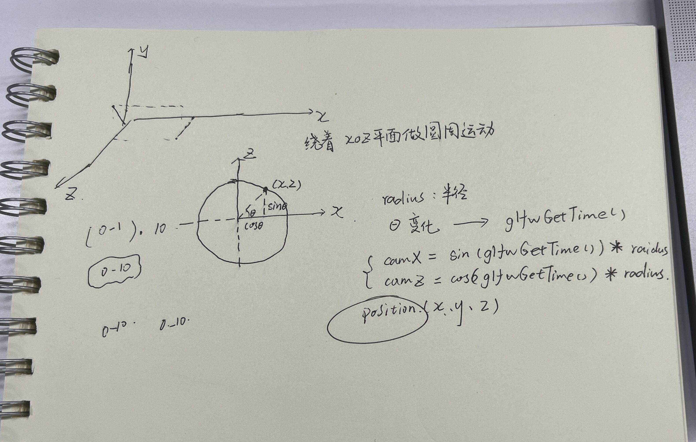

## Sixth submission ----> branch[perspective]

1. Draw a photo(Texture).  

2. Encapsulated the shader class.  

3. Add camera.  
    [For specific instructions, please refer to add-camera](../add-camera)

4. Perspective  
    [For specific instructions, please refer to perspective-matrix](../perspective-matrix/)

5. __Camera Circle__
    
    The position of the object remains fixed, and the camera moves in a circular motion in the xoz plane.

    