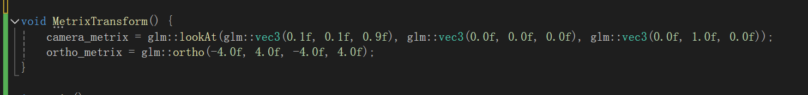
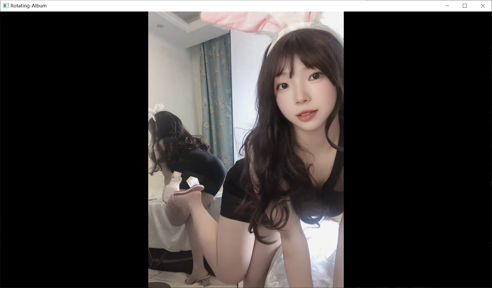
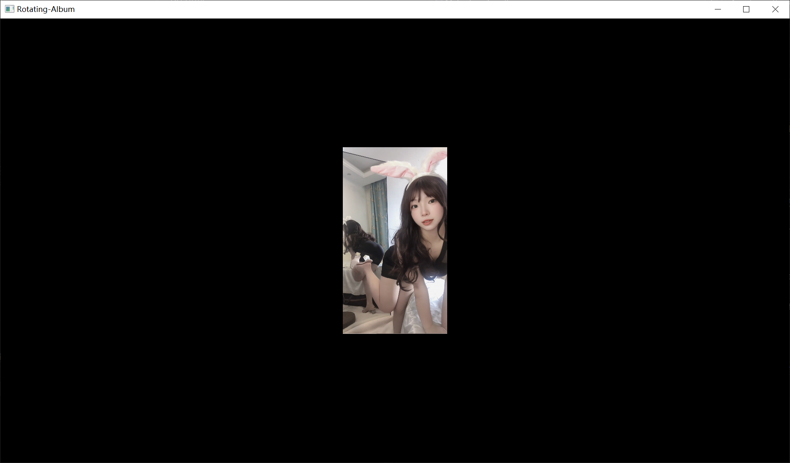

## Sixth submission ----> branch[ortho]

1. Draw a photo(Texture).  

2. Encapsulated the shader class.  

3. Add camera   
    [For specific instructions, please refer to add-camera](../add-camera/)

4. __Add ortho__  

    4.1 metrix data :
      

    4.2 Program running image display :  
    - before
    
    - after
    

