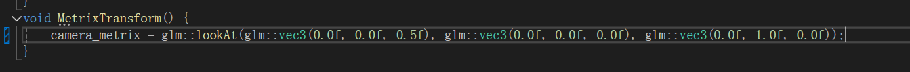
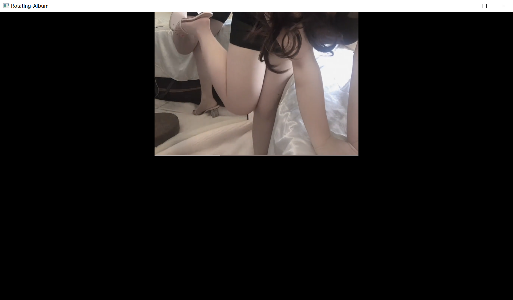
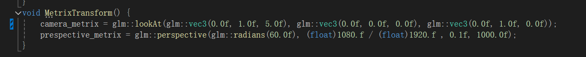
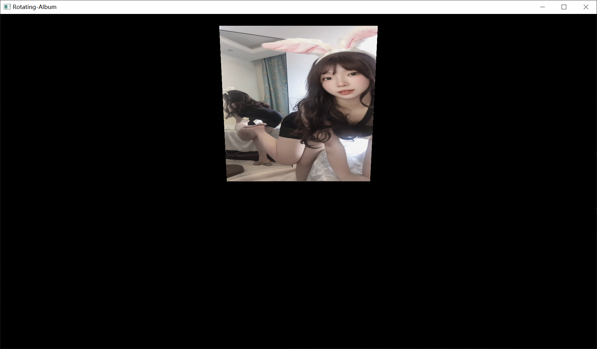

## Sixth submission ----> branch[perspective]

1. Draw a photo(Texture).  

2. Encapsulated the shader class.  

3. __Add camera.__  
    [For specific instructions, please refer to add-camera](../add-camera)

4. __Perspective__  
    - before

      

      
    - after 

      

      