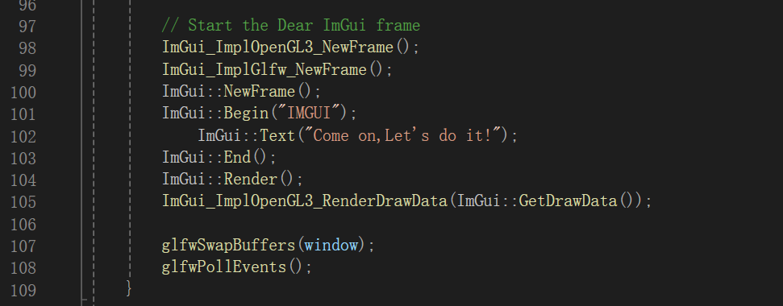

# SKELETAL-ANIMATION

## Instruction  

- If you wanna quickly develop your own skeletal animation or 3D model rendering:  

	```
	git clone https://github.com/zsh-Iresh/3DRender.git
	```
	```
	git checkout c0d68ccdc4c6e18424c079fc5629edbdd800ea2e
	```
- In this version branch,you can find the 3D model in the assets/model folder which contains a simple nanosuit model.
If you have your own 3D model,you can create it using following code in main.cpp:  
	```
	Model assimp_model = Model("assets/model/nanosuit/nanosuit.obj");
	```
- If you wanna use imgui,you can refer to imgui.cpp and 
add components at the code location in the following image:  

	